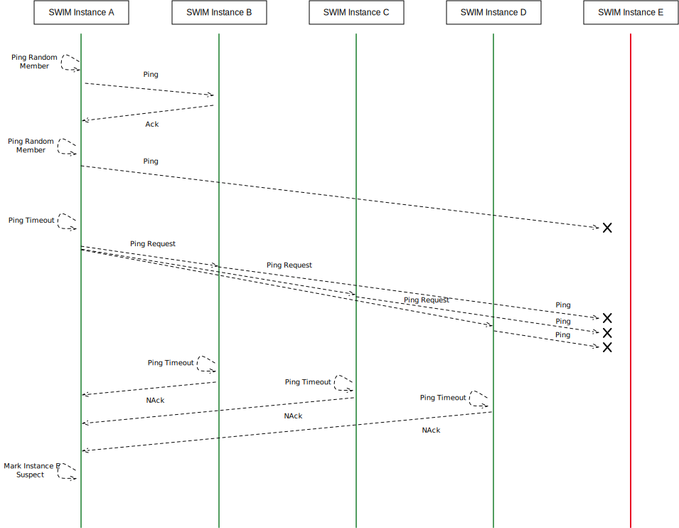
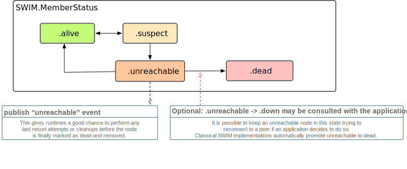

# Swift Cluster Membership

This library aims to help Swift make ground in a new space: clustered multi-node distributed systems. 

With this library we provide reusable runtime agnostic membership protocol implementations which can be adopted in various clustering use-cases.

## Background

Cluster Membership protocols are a foundational and important building block for distributed systems, such as databases, key-value stores, computation intensive clusters, schedulers and more. With the announcement of this package, we aim to make building such systems simpler, and also invite the community to collaborate on and develop additional membership protocols.

At their core, membership protocols need to provide an answer for the question "what are my (live) peers?" whenever a node in a clustered environment asks itself this question. This seemingly "simple" task turns out to be not so simple at all in a distributed system where delayed or lost messages, network partitions, and unresponsive but still "alive" nodes are the daily bread and butter. Providing a predictable, reliable answer to such question is what cluster membership protocols do.

There are various trade-offs one can take while implementing a membership protocol, and it continues to be an interesting area of research and continued refinement. As such, the cluster-membership package intends to focus not on a single implementation, but serve as a collaboration space for various algorithms.

Today, along with the initial release of this package, we’re open sourcing an implementation of one such membership protocol:

## 🏊‍♀️🏊‍♂️🐟 SWIMming with Swift

The first membership protocol we are open sourcing is an implementation of the [*Scalable Weakly-consistent Infection-style process group Membership*](https://research.cs.cornell.edu/projects/Quicksilver/public_pdfs/SWIM.pdf) algorithm (also known as "SWIM"), along with a few notable protocol extensions as documented in the 2018 [*Lifeguard: Local Health Awareness for More Accurate Failure Detection*](https://arxiv.org/abs/1707.00788) paper.

SWIM is a [gossip protocol](https://en.wikipedia.org/wiki/Gossip_protocol) in which peers periodically exchange bits of information about their observations of other nodes’ statuses, eventually spreading the information to all other members in a cluster. This category of distributed algorithms are very resilient against arbitrary message loss, network partitions and similar issues.

At a high level, SWIM works like this: 

* A member periodically pings a randomly selected peer it is aware of. It does so by sending a `Ping` message (along with some metadata) to that peer, expecting an `Ack` to be sent back. See how `A` probes `B` initially in the diagram below.
* If it receives an ack, the peer is considered still alive. Otherwise, the target peer might have terminated/crashed or is unresponsive for other reasons. In order to double check if the peer really is down, the origin asks a few other peers about the state of the unresponsive peer by sending `Ping Request` messages to a configured number of other peers, which then issue direct pings to that peer (probing peer `E` in the diagram below).
* If those pings fail, the origin peer would receive `NAck` ("negative acknowledgement") messages back, resulting in the peer being marked as `.suspect`.



Eventually a peer may become `.unreachable` and `.dead` resulting in its irrevocable removal from the cluster. For detailed rules about status transition refer to `SWIM.MemberStatus`. While this describes the failure detection mechanism of SWIM, it also serves another purpose: disseminating the membership information, which is transparently piggy backed onto these periodic message exchanges.



It should be noted that, as the name implies, this style of membership is *weakly-consistent*, which means there is no guarantee (or way to know, without additional extensions) if all members have the same exact view on the membership. However, it is an excellent building block for higher-level tools and systems to build their stronger guarantees on top.

In order to "actually do anything", the `SWIM.Instance` needs to be "driven" or "interpreted" by some glue code between a networking runtime and the instance itself. We call those glue pieces of an implementation "Shells", and the library ships with a SWIM Shell implemented using [SwiftNIO](https://www.github.com/apple/swift-nio)’s `DatagramChannel` that performs all messaging asynchronously over UDP. Alternative implementations could use alternative transports, or piggy back SWIM messages on some other existing gossip system etc.

The SWIM instance also has built-in support for emitting metrics (using [swift-metrics](https://github.com/apple/swift-metrics)) and can be configured to log details about internal details by passing a [swift-log](https://github.com/apple/swift-log) `Logger`.

## Example: SWIMming with SwiftNIO

The repository contains an end-to-end example implementation of making use of the SWIM instance inside an SWIMNIO UDP system. This allows peers to gossip and notify each other about node failures using the SWIM protocol by sending datagrams driven by SwiftNIO.

The SWIMNIO (UDP) implementation is only an example, and has not been implemented with production use in mind, however with some amount of effort it could definitely do well for some use-cases. If you are interested in learning more about cluster membership algorithms, scalability benchmarking and using swift-nio itself, this is a great module to get your feet wet, and perhaps once the module is mature enough we could consider making it not only an example, but a  reusable component for swift-nio based clustered applications.


### Making use of the SWIM state-machine

As previously mentioned, the `SWIM.Instance` is a pure state-machine, not performing any IO, and thus making use of it requires plugging some pieces together for the specific runtime. Let us quickly analyze how an implementation looks like.

We will create a "Shell" type, that will encapsulate all interactions of the algorithms state machine, and the external IO (and timers and such). All the API that we should prepare to call into on the state machine is defined on the `SWIMProtocol`, we can have a look at it to get an idea what we have to implement in a shell:

The short version on getting a SWIM instance hooked interpreted and serving for your use cases using a new Shell is the following:

1. Implement **SWIMPeerProtocol** which makes implementing sending message simple,
2. Implement your `...Shell` hooking it into your preferred networking library, and call all the **SWIMProtocol** in a way as documented (on timer or on receipt of a message),
3. There is no step 3.

```swift
public protocol SWIMProtocol {

    // MARK: - Timer Driven

    /// Must be invoked periodically to drive the periodic information gossiping to other nodes.
    /// <...>
    func onPeriodicGossipTick() -> SWIM.Instance.PeriodicGossipDirective

    // MARK: - Message Receipts

    /// Must be invoked whenever a `Ping` message is received.
    /// <...>
    func onPing(
        payload: SWIM.GossipPayload
    ) -> [SWIM.Instance.OnPingDirective]

    /// Must be invoked when a `pingRequest` is received.
    /// <...>
    func onPingRequest(
        target: SWIMPeerProtocol,
        replyTo: SWIMPeerProtocol,
        payload: SWIM.GossipPayload
    ) -> [SWIM.Instance.PingRequestDirective]

    /// Must be invoked when a response to a ping (or indirect ping) is received.
    /// <...>
    func onPingResponse(
        response: SWIM.PingResponse,
        pingReqOrigin: SWIMPeerReplyProtocol?,
        sequenceNr: SWIM.SequenceNr
    ) -> [OnPingResponseDirective]
    
    // ... 

}
```

Reading the comments on this protocol’s functions (the full comments are in the linked source code), we already have a rough idea how we should implement interactions with the instance in our shell. In our Swift NIO implementation we host all logic interacting between the channels and the instance in `SWIMNIO.Shell`:

```swift
// final class SWIMNIO.Shell { 
    let myself: SWIMPeer = ...
    var swim = SWIM.Instance(settings: settings, myself: myself) // TODO: myself???
// ...
// } 
```

By reading the SWIMProtocol’s comments, we already know how to 
 Roughly there are three types of tasks we need to handle:

1. schedule a timer to **periodically** invoke `swim.onPeriodicGossipTick`
    1. The schedule at which this timer should fire is configured in `SWIM.Settings` which we can access in our shell via `swim.settings`. 
2. whenever we’re instructed by a directive to **send messages**, build and send the message,
3. whenever we **receive a message**, invoke the appropriate `swim.on...` function, and switch over its returned directive to get type-safe "instructions" what we should do next
    1. E.g. the `onPriodicGossipTick` usually will return a `.sendPing(to:payload:timeout:)` directive which we’ll simply implement by sending such message to the appropriate peer (we’ll discuss below some helpers around sending messages as well).

Next, we need to implement the [`SWIMPeerProtocol`](Sources/SWIM/SWIMPeer.swift) which will be used to represent any member of the cluster, in a way that makes it easier to reason about the protocol and operations we need to perform on the specific peers when instructed to by the instance.

The protocol roughly corresponds to the types of messages we need to be able to send to specific peers over the network:


```swift
public protocol AddressableSWIMPeer {
    /// Node that this peer is representing.
    var node: ClusterMembership.Node { get }
}

public protocol SWIMPeerReplyProtocol: AddressableSWIMPeer {
    /// Acknowledge a ping.
    func ack(
        target: AddressableSWIMPeer, 
        incarnation: SWIM.Incarnation, 
        payload: SWIM.GossipPayload,
        sequenceNr: SWIM.SequenceNr
    )

    /// "NegativeAcknowledge" a ping.
    func nack(
        target: AddressableSWIMPeer,
        sequenceNr: SWIM.SequenceNr
    )
}

public protocol SWIMPeerProtocol: SWIMPeerReplyProtocol {
    /// "Ping" another SWIM peer.
    func ping(
        payload: SWIM.GossipPayload,
        from origin: AddressableSWIMPeer,
        timeout: SWIMTimeAmount,
        onComplete: @escaping (Result<SWIM.PingResponse, Error>) -> Void
    )

    /// "Ping Request" a SWIM peer.
    func pingRequest(
        target: AddressableSWIMPeer,
        payload: SWIM.GossipPayload,
        from origin: AddressableSWIMPeer,
        timeout: SWIMTimeAmount,
        onComplete: @escaping (Result<SWIM.PingResponse, Error>) -> Void
    )

    /// Type erase this member into an `AnySWIMPeer`
    var asAnyPeer: AnySWIMPeer { get }
}
```

Various networking runtimes may implement this differently, e.g. if the underlying messaging protocol has the concept of request/reply messages one can make use of those to implement the ping/ack message exchange, if not (like in our UDP environment) we’ll have to make use of e.g. sequence numbers or other request identifiers to correlate messages.

Having those functions implemented, by sending messages onto an `NIO.DatagramChannel`, implementing the message receiving in the shell is relatively straight forward:

```swift
func receiveMessage(message: SWIM.Message) {
    // ...
    switch message {
    case .ping(let origin, let payload, let sequenceNr):
        self.processGossipPayload(payload: payload)

        switch self.swim.onPing(payload: paylaod){
        case .reply(let reply):
            switch reply {
            case .ack(let target, let incarnation, let payload, let sequenceNr):
                origin.ack(target: target, incarnation: incarnation, payload: payload, sequenceNr: sequenceNr)
                
            // handler other directive cases ...
            }
        }
    }
}
```

The full implementation of both the Shell and Peer are available in the [SWIMNIO](Sources/SWIMNIO) module, and if you’re interested in digging deeper you can get the full picture by reading the code there yourself.

## Contributing

Your experience, feedback, and contributions are greatly encouraged!

Please refer to [CONTRIBUTING](CONTRIBUTING.md) guide to learn about the process of submitting pull requests,
and refer to the [HANDBOOK](HANDBOOK.md) for terminology and other useful tradeoff discussions and additional 
implementation guidelines.


