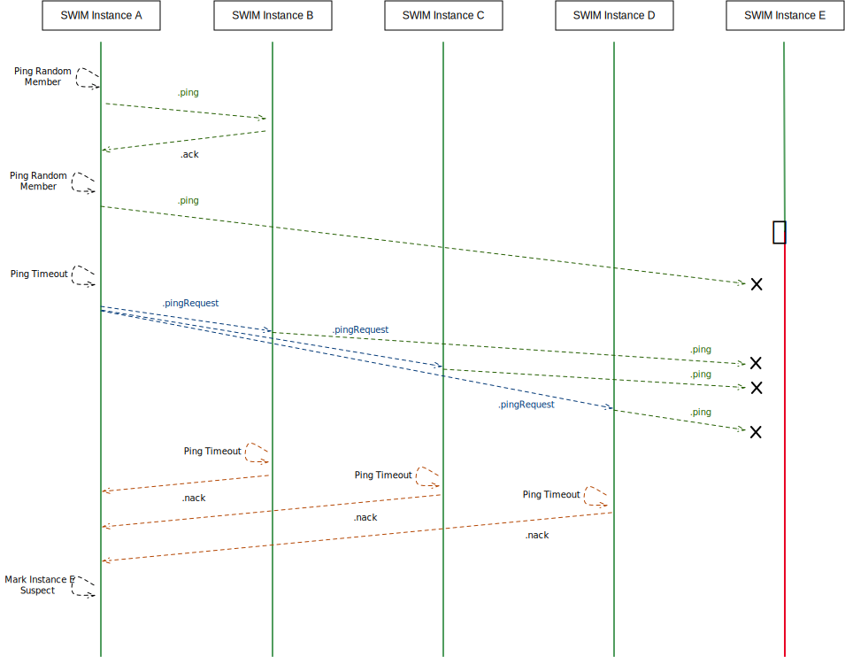
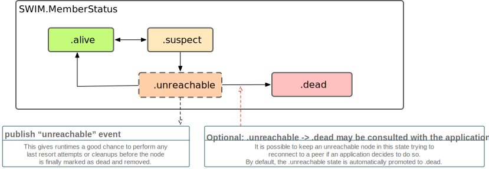

# Swift Cluster Membership

This library aims to help Swift make ground in a new space: clustered multi-node distributed systems. 

With this library we provide reusable runtime agnostic membership protocol implementations which can be adopted in various clustering use-cases.

## Background

Cluster membership protocols are a crucial building block for distributed systems, such as computation intensive clusters, schedulers, databases, key-value stores and more. With the announcement of this package, we aim to make building such systems simpler, as they no longer need to rely on external services to handle service membership for them. We would also like to invite the community to collaborate on and develop additional membership protocols.

At their core, membership protocols need to provide an answer for the question "Who are my (live) peers?". This seemingly simple task turns out to be not so simple at all in a distributed system where delayed or lost messages, network partitions, and unresponsive but still "alive" nodes are the daily bread and butter. Providing a predictable, reliable answer to this question is what cluster membership protocols do.

There are various trade-offs one can take while implementing a membership protocol, and it continues to be an interesting area of research and continued refinement. As such, the cluster-membership package intends to focus not on a single implementation, but serve as a collaboration space for various distributed algorithms in this space.

## 🏊🏾‍♀️🏊🏻‍♀️🏊🏾‍♂️🏊🏼‍♂️ SWIMming with Swift

### High-level Protocol Description

> For a more in-depth discussion of the protocol and modifications in this implementation we suggest reading the [SWIM API Documentation](https://apple.github.io/swift-cluster-membership/docs/current/SWIM/Enums/SWIM.html), as well as the associated papers linked below.

The [*Scalable Weakly-consistent Infection-style process group Membership*](https://research.cs.cornell.edu/projects/Quicksilver/public_pdfs/SWIM.pdf) algorithm (also known as "SWIM"), along with a few notable protocol extensions as documented in the 2018 [*Lifeguard: Local Health Awareness for More Accurate Failure Detection*](https://arxiv.org/abs/1707.00788) paper.

SWIM is a [gossip protocol](https://en.wikipedia.org/wiki/Gossip_protocol) in which peers periodically exchange bits of information about their observations of other nodes’ statuses, eventually spreading the information to all other members in a cluster. This category of distributed algorithms are very resilient against arbitrary message loss, network partitions and similar issues.

At a high level, SWIM works like this: 

* A member periodically pings a "randomly" selected peer it is aware of. It does so by sending a .ping message to that peer, expecting an [`.ack`](https://apple.github.io/swift-cluster-membership/docs/current/SWIM/Protocols/SWIMPingOriginPeer.html#/s:4SWIM18SWIMPingOriginPeerP3ack13acknowledging6target11incarnation7payloadys6UInt32V_AA8SWIMPeer_ps6UInt64VA2AO13GossipPayloadOtF) to be sent back. See how `A` probes `B` initially in the diagram below.
    * The exchanged messages also carry a gossip `payload`, which is (partial) information about what other peers the sender of the message is aware of, along with their membership status (`.alive`, `.suspect`, etc.)
* If it receives an `.ack`, the peer is considered still `.alive`. Otherwise, the target peer might have terminated/crashed or is unresponsive for other reasons. 
    * In order to double check if the peer really is dead, the origin asks a few other peers about the state of the unresponsive peer by sending `.pingRequest` messages to a configured number of other peers, which then issue direct pings to that peer (probing peer E in the diagram below).
* If those pings fail, due to lack of .acks resulting in the peer being marked as `.suspect`,
    * Our protocol implementation will also use additional `.nack` ("negative acknowledgement") messages in the situation to inform the ping request origin that the intermediary did receive those `.pingRequest` messages, however the target seems to not have responded. We use this information to adjust a Local Health Multiplier, which affects how timeouts are calculated. To learn more about this refer to the API docs and the Lifeguard paper.



The above mechanism, serves not only as a failure detection mechanism, but also as a gossip mechanism, which carries information about known members of the cluster. This way members eventually learn about the status of their peers, even without having them all listed upfront. It is worth pointing out however that this membership view is [weakly-consistent](https://en.wikipedia.org/wiki/Weak_consistency), which means there is no guarantee (or way to know, without additional information) if all members have the same exact view on the membership at any given point in time. However, it is an excellent building block for higher-level tools and systems to build their stronger guarantees on top.

Once the failure detection mechanism detects an unresponsive node, it eventually is marked as  .dead resulting in its irrevocable removal from the cluster. Our implementation offers an optional extension, adding an .unreachable state to the possible states, however most users will not find it necessary and it is disabled by default. For details and rules rules about legal status transitions refer to [SWIM.Status](https://github.com/apple/swift-cluster-membership/blob/main/Sources/SWIM/Status.swift#L18-L39) or the following diagram:



The way Swift Cluster Membership implements protocols, is by offering "`Instances`" of them. For example, the SWIM implementation is encapsulated in the runtime agnostic [`SWIM.Instance`](https://github.com/apple/swift-cluster-membership/blob/main/Sources/SWIM/SWIMInstance.swift) which needs to be “driven” or “interpreted” by some glue code between a networking runtime and the instance itself. We call those glue pieces of an implementation "`Shell`s", and the library ships with a `SWIMNIOShell` implemented using [SwiftNIO](https://www.github.com/apple/swift-nio)’s `DatagramChannel` that performs all messaging asynchronously over [UDP](https://searchnetworking.techtarget.com/definition/UDP-User-Datagram-Protocol). Alternative implementations can use completely different transports, or piggy back SWIM messages on some other existing gossip system etc.

The SWIM instance also has built-in support for emitting metrics (using [swift-metrics](https://github.com/apple/swift-metrics)) and can be configured to log details about internal details by passing a [swift-log](https://github.com/apple/swift-log) `Logger`.

### Example: Reusing the SWIM protocol logic implementation

The primary purpose of this library is to share the `SWIM.Instance` implementation across various implementations which need some form of in-process membership service. Implementing a custom runtime is documented in depth in the project’s README (https://github.com/apple/swift-cluster-membership/), so please have a look there if you are interested in implementing SWIM over some different transport.

Implementing a new transport boils down a “fill in the blanks” exercise: 

First, one has to implement the Peer protocols (https://github.com/apple/swift-cluster-membership/blob/main/Sources/SWIM/Peer.swift) using one’s target transport:

```swift
/// SWIM peer which can be initiated contact with, by sending ping or ping request messages.
public protocol SWIMPeer: SWIMAddressablePeer {
    /// Perform a probe of this peer by sending a `ping` message.
    /// 
    /// <... more docs here - please refer to the API docs for the latest version ...>
    func ping(
        payload: SWIM.GossipPayload,
        from origin: SWIMPingOriginPeer,
        timeout: DispatchTimeInterval,
        sequenceNumber: SWIM.SequenceNumber
    ) async throws -> SWIM.PingResponse
    
    // ... 
}
```

Which usually means wrapping some connection, channel, or other identity with the ability to send messages and invoke the appropriate callbacks when applicable. 

Then, on the receiving end of a peer, one has to implement receiving those messages and invoke all the corresponding `on<SomeMessage>(...)` callbacks defined on the `SWIM.Instance` (grouped under [SWIMProtocol](https://github.com/apple/swift-cluster-membership/blob/main/Sources/SWIM/SWIMInstance.swift#L24-L85)).

A piece of the SWIMProtocol is listed below to give you an idea about it:


```swift
public protocol SWIMProtocol {

    /// MUST be invoked periodically, in intervals of `self.swim.dynamicLHMProtocolInterval`.
    ///
    /// MUST NOT be scheduled using a "repeated" task/timer", as the interval is dynamic and may change as the algorithm proceeds.
    /// Implementations should schedule each next tick by handling the returned directive's `scheduleNextTick` case,
    /// which includes the appropriate delay to use for the next protocol tick.
    ///
    /// This is the heart of the protocol, as each tick corresponds to a "protocol period" in which:
    /// - suspect members are checked if they're overdue and should become `.unreachable` or `.dead`,
    /// - decisions are made to `.ping` a random peer for fault detection,
    /// - and some internal house keeping is performed.
    ///
    /// Note: This means that effectively all decisions are made in interval sof protocol periods.
    /// It would be possible to have a secondary periodic or more ad-hoc interval to speed up
    /// some operations, however this is currently not implemented and the protocol follows the fairly
    /// standard mode of simply carrying payloads in periodic ping messages.
    ///
    /// - Returns: `SWIM.Instance.PeriodicPingTickDirective` which must be interpreted by a shell implementation
    mutating func onPeriodicPingTick() -> [SWIM.Instance.PeriodicPingTickDirective]

    mutating func onPing( ... ) -> [SWIM.Instance.PingDirective]

    mutating func onPingRequest( ... ) -> [SWIM.Instance.PingRequestDirective]

    mutating func onPingResponse( ... ) -> [SWIM.Instance.PingResponseDirective]

    // ... 
}
```

These calls perform all SWIM protocol specific tasks internally, and return directives which are simple to interpret “commands” to an implementation about how it should react to the message. For example, upon receiving a `.pingRequest` message, the returned directive may instruct a shell to send a ping to some nodes. The directive prepares all apropriate target, timeout and additional information that makes it simpler to simply follow its instruction and implement the call correctly, e.g. like this:

```swift
self.swim.onPingRequest(
    target: target,
    pingRequestOrigin: pingRequestOrigin,            
    payload: payload,
    sequenceNumber: sequenceNumber
).forEach { directive in
    switch directive {
    case .gossipProcessed(let gossipDirective):
        self.handleGossipPayloadProcessedDirective(gossipDirective)

    case .sendPing(let target, let payload, let pingRequestOriginPeer, let pingRequestSequenceNumber, let timeout, let sequenceNumber):
        self.sendPing(
            to: target,
            payload: payload,
            pingRequestOrigin: pingRequestOriginPeer,
            pingRequestSequenceNumber: pingRequestSequenceNumber,
            timeout: timeout,
            sequenceNumber: sequenceNumber
        )
    }
}
```

In general this allows for all the tricky "what to do when" to be encapsulated within the protocol instance, and a Shell only has to follow instructions implementing them. The actual implementations will often need to perform some more involved concurrency and networking thasks, like awaiting for a sequence of responses, and handling them in a specific way etc, however the general outline of the protocol is orchestrated by the instance's directives.

For detailed documentation about each of the callbacks, when to invoke them, and how all this fits together, please refer to the [**API Documentation**](https://apple.github.io/swift-cluster-membership/docs/current/SWIM/index.html).

### Example: SWIMming with Swift NIO

The repository contains an [end-to-end example](Samples/Sources/SWIMNIOSampleCluster) and an example implementation called [SWIMNIOExample](Sources/SWIMNIOExample) which makes use of the `SWIM.Instance` to enable a simple UDP based peer monitoring system. This allows peers to gossip and notify each other about node failures using the SWIM protocol by sending datagrams driven by SwiftNIO.

> 📘 The `SWIMNIOExample` implementation is offered only as an example, and has not been implemented with production use in mind, however with some amount of effort it could definitely do well for some use-cases. If you are interested in learning more about cluster membership algorithms, scalability benchmarking and using SwiftNIO itself, this is a great module to get your feet wet, and perhaps once the module is mature enough we could consider making it not only an example, but a reusable component for Swift NIO based clustered applications.

In it’s simplest form, combining the provided SWIM instance and NIO shell to build a simple server, one can embedd the provided handlers like shown below, in a typical NIO channel pipeline:

```swift
let bootstrap = DatagramBootstrap(group: group)
    .channelOption(ChannelOptions.socketOption(.so_reuseaddr), value: 1)
    .channelInitializer { channel in
        channel.pipeline
            // first install the SWIM handler, which contains the SWIMNIOShell:
            .addHandler(SWIMNIOHandler(settings: settings)).flatMap {
                // then install some user handler, it will receive SWIM events:
                channel.pipeline.addHandler(SWIMNIOExampleHandler())
        }
    }

bootstrap.bind(host: host, port: port)
```

The example handler can then receive and handle SWIM cluster membership change events:

```swift
final class SWIMNIOExampleHandler: ChannelInboundHandler {
    public typealias InboundIn = SWIM.MemberStatusChangedEvent
    
    let log = Logger(label: "SWIMNIOExampleHandler")
    
    public func channelRead(context: ChannelHandlerContext, data: NIOAny) {
        let change: SWIM.MemberStatusChangedEvent = self.unwrapInboundIn(data)

        self.log.info("Membership status changed: [\(change.member.node)] is now [\(change.status)]", metadata: [    
            "swim/member": "\(change.member.node)",
            "swim/member/status": "\(change.status)",
        ])
    }
}
```

If you are interested in contributing and polishing up the SWIMNIO implementation please head over to the issues and pick up a task or propose an improvement yourself!

## Additional Membership Protocol Implementations

We are generally interested in fostering discussions and implementations of additional membership implementations using a similar "Instance" style.

If you are interested in such algorithms, and have a favourite protocol that you'd like to see implemented, please do not hesitate to reach out heve via issues or the [Swift forums](https://forums.swift.org/c/server).

## Contributing

Experience reports, feedback, improvement ideas and contributions are greatly encouraged! 
We look forward to hear from you.

Please refer to [CONTRIBUTING](CONTRIBUTING.md) guide to learn about the process of submitting pull requests,
and refer to the [HANDBOOK](HANDBOOK.md) for terminology and other useful tips for working with this library.


